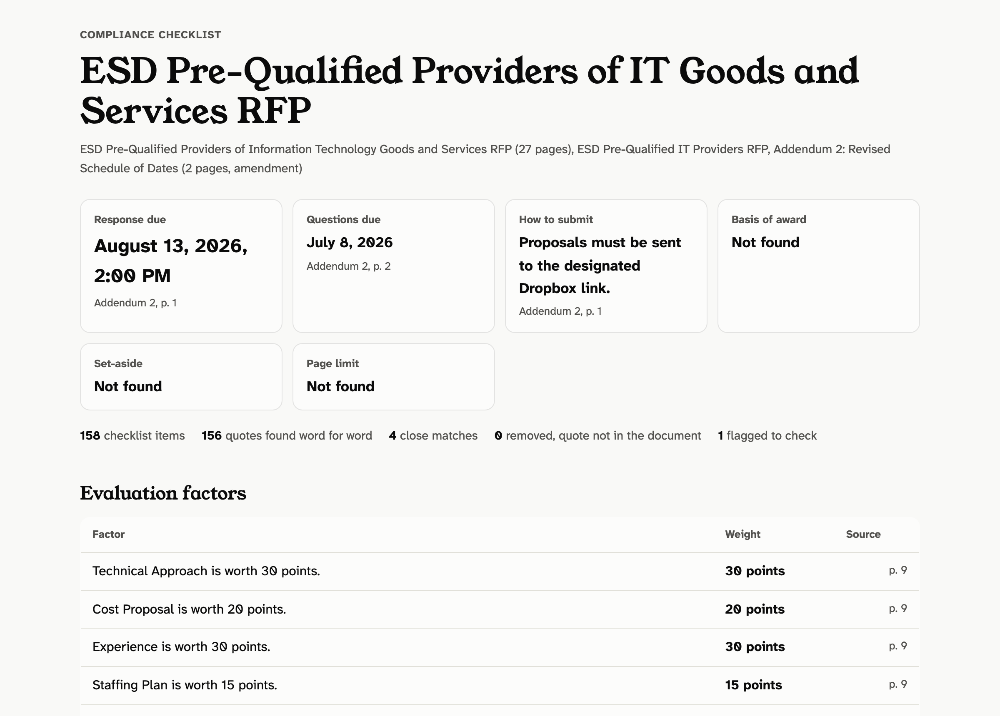
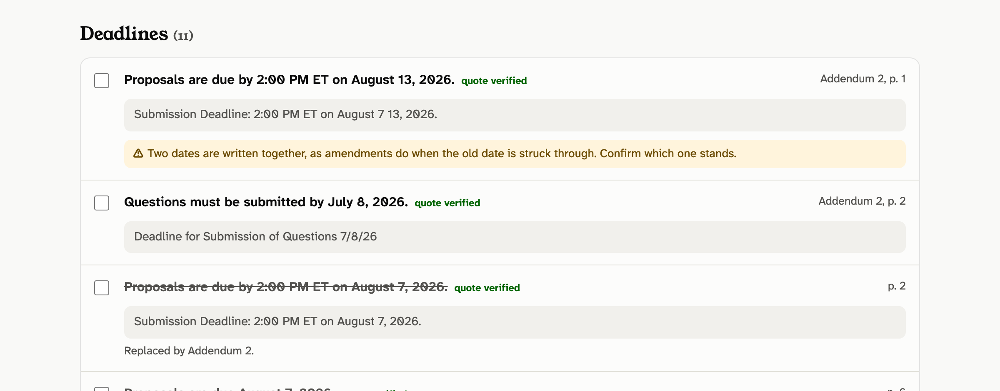
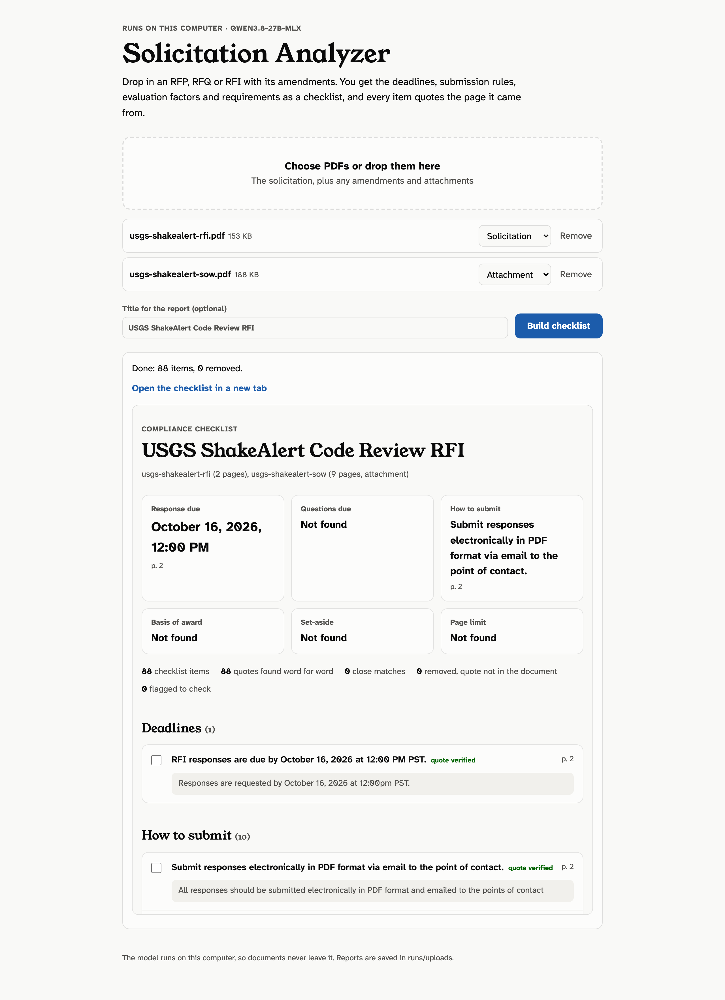

# Solicitation Analyzer

Turns an RFP, RFQ or RFI PDF into a compliance checklist: deadlines, how to submit, page limits, eligibility, evaluation factors and what the response must contain. **Every item quotes the page it came from, and the tool checks that quote against the PDF before it shows it.** Items whose quote is not in the document are removed and listed, not shown as fact.

It runs on a local open-weight model by default, so a solicitation and any draft response never leave the machine. A hosted model can be used instead.



## Why the quote check matters

Language models summarize documents well and occasionally invent a detail with complete confidence. In a bid, an invented deadline or page limit is the expensive kind of mistake. So the model is never trusted on its own word:

1. **The model must quote.** Each item carries 8 to 35 words copied from the page, plus the page number from a marker in its input.
2. **The quote is looked up in the PDF text.** Both sides are reduced to letters and digits, so line breaks, hyphenation and layout spacing cannot cause a false miss. The check also covers quotes that run across a page break and two-column pages, using a reading-order copy of the text. A quote found on a different page than cited is moved and flagged. A quote 90% similar or better is kept as a "close match".
3. **Tables get a weaker, flagged match.** A model reading across table cells writes the right words in a new order. If every content word sits close together on the cited page, the item is kept with a "read the table" warning. Anything else is removed and listed.
4. **Dates and times are checked against the quote.** A normalized date that is not written in the quoted words gets a warning.
5. **Amendments are applied.** A deadline restated in an amendment replaces the base document's date, and the old one stays visible, struck through.
6. **Struck-through revisions are caught.** Amendments often show a change as "August ~~7~~ 13, 2026", which becomes "August 7 13, 2026" in the PDF text. The tool reads both dates and asks a person to confirm which one stands.

## Results on public solicitations

The test set is 8 public documents in 5 packages: two New York State RFPs, a federal RFI with its statement of work, an Air Force RFP with its amendment, and an Indian Health Service SDVOSB set-aside. Reference answers in [`eval/gold/`](eval/gold) were written by reading each document. The same questions are put to a keyword baseline with no model, so the numbers show what the model adds.

| Measure | Model (local Qwen 3.8 27B) | Keyword baseline |
|---|---:|---:|
| Key facts right: due dates, questions deadline, how to submit, page limit, basis of award, set-aside, NAICS | 34/35 (97%) | 29/35 (83%) |
| Deadline times right | 6/6 | 4/5 |
| Evaluation factors found, with weights | 15/15 (100%) | 10/15 (67%) |
| Must-do checklist items covered | 57/58 (98%) | 39/58 (67%) |

**Quote check:** of 718 model items, 705 quotes were found word for word, 6 were close matches, 7 were read across table cells and flagged, and 2 were removed. Both removals were two-word fragments ("2. Price") too short to check. Two deadlines were replaced by amendments, including ESD's Addendum 2 moving proposals from August 7 to August 13, 2026.



**Read these numbers with three caveats:**
- The reference answers were written by the same team that built the tool.
- The first run on this set exposed checker gaps, and the fixes were then measured on the same documents. Those gaps were quotes running across a page break, two-column pages and tables. The wording rules that sort set-aside, NAICS and questions-deadline lines were also added after reading that run. A held-out set of solicitations is the next step.
- Speed: all 129 pages took about 50 minutes on an Apple M5 Max with four requests at a time. A 2-page RFI with its 9-page statement of work took about 4 minutes in the web page. A hosted model is much faster.

Full per-package results: [`eval/RESULTS.md`](eval/RESULTS.md). Browse the sample reports at **https://howlshot.github.io/solicitation-analyzer/** (saved outputs; nothing runs and no key is needed).

## Models tested

| | Qwen 3.8 27B (LM Studio) | Qwen3.8-Flash-Next (mlx-serve) |
|---|---:|---:|
| Key facts right | 34/35 | 34/35 |
| Must-do items covered | 57/58 | 55/58 |
| Time for all 129 pages | ~49 min | ~21 min |

Same accuracy within a couple of items; Flash-Next is about twice as fast. The sample reports above use the 27B. Flash-Next results: [`eval/flash-next/`](eval/flash-next).

## How it works

```
solicitation_analyzer/
  pdf.py        PDF text by page (poppler's pdftotext), so citations match the printed page
  extract.py    pages in with <<<PAGE n>>> markers, schema-constrained JSON items out
  textmatch.py  the quote check: exact, close match, or removed
  dates.py      dates and times as solicitations write them, including struck-through revisions
  analyze.py    verify, merge repeats, apply amendments, pick the key facts
  report.py     JSON, Markdown and a self-contained HTML checklist
  llm.py        local OpenAI-compatible server (default) or Anthropic, with an on-disk reply cache
  server.py     local web page: drop in PDFs, get the checklist
  baseline.py   keyword rules with no model, for the evaluation
  scoring.py    scores a report against the reference answers
```

There are no Python dependencies outside the standard library. PDF text comes from `pdftotext` (poppler).

## Run it

You need Python 3.11 or later, poppler, and a model server.

```bash
brew install poppler
```

**Local model (default).** Start an OpenAI-compatible server such as [LM Studio](https://lmstudio.ai) or `llama-server`, load a model, and point the tool at it. The results above used Qwen 3.8 27B (MLX, 8-bit) in LM Studio on an Apple M5 Max.

```bash
python3 -m solicitation_analyzer analyze RFP.pdf --amendment Addendum-1.pdf --attachment SOW.pdf --out reports/my-rfp --parallel 4
```

**Web page.** Drop PDFs in and read the checklist in the browser. It listens on 127.0.0.1 only.



```bash
python3 -m solicitation_analyzer serve --parallel 4
```

**mlx-serve.** Add `--base-url http://127.0.0.1:1237/v1 --model <id>` and set `JSON_SCHEMA_MODE=prompt`. Its schema-enforced output runs about 7 times slower.

**Hosted model.** Set `ANTHROPIC_API_KEY` in your environment and add `--provider anthropic`. The published results do not use it.

**Tests and evaluation.**

```bash
python3 -m unittest discover -s tests -t .   # no model or network needed
python3 scripts/fetch_samples.py             # downloads the public test set
python3 scripts/run_samples.py --parallel 4  # regenerates reports/ (cached replies make re-runs free)
python3 scripts/run_eval.py                  # writes eval/RESULTS.md
```

## Limits

- Scanned PDFs without a text layer are skipped with a warning; they need OCR first.
- Word and Excel attachments are not read. Convert them to PDF.
- The checklist is a reading aid. Check every deadline and requirement against the solicitation before you submit.
- The sample reports replace people's names, emails and phone numbers with placeholders (`--redact-contacts`). The tool keeps them by default, because a bidder needs them.

## About

Built by [Studio Chingie LLC](https://studiochingie.com/services), a service-disabled veteran-owned small business that builds custom software, document automation and AI tools for government and business. Code under the [MIT License](LICENSE). The solicitations belong to the agencies that issued them and are linked from [`samples/manifest.json`](samples/manifest.json), not copied into this repository.
